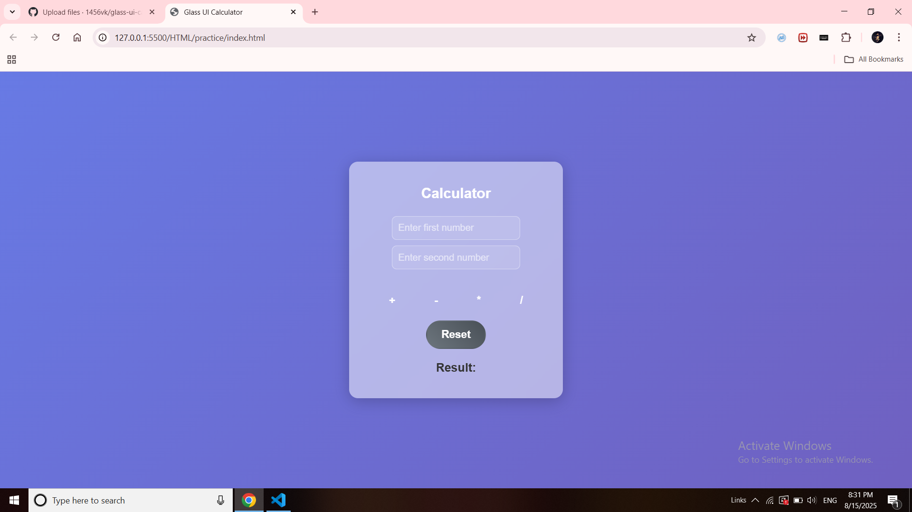

# Glass UI Calculator

A modern and responsive calculator built using **HTML**, **CSS**, and **JavaScript** with a beautiful glassmorphism effect.

## 🚀 Live Demo
[Click here to use the Calculator](https://1456vk.github.io/glass-ui-calculator)

## 📸 Screenshot


## ✨ Features
- ➕ **Addition**, ➖ **Subtraction**, ✖ **Multiplication**, ➗ **Division**
- ❌ Division by zero handling
- 📱 Fully responsive design (Mobile, Tablet, Desktop)
- 🎨 Modern glass UI with gradient background

## 🛠️ Technologies Used
- **HTML5**
- **CSS3** (Glassmorphism, Gradient Background, Media Queries)
- **JavaScript** (ES6, DOM Manipulation)

## 📂 How to Use
1. Clone the repository:
   ```bash
   git clone https://github.com/1456vk/glass-ui-calculator.git
